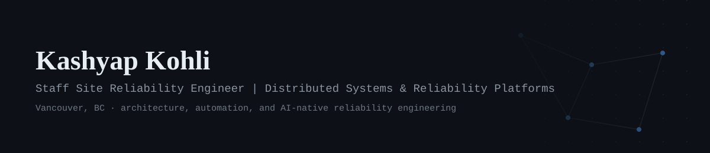
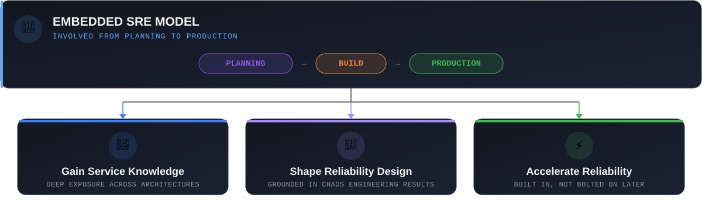
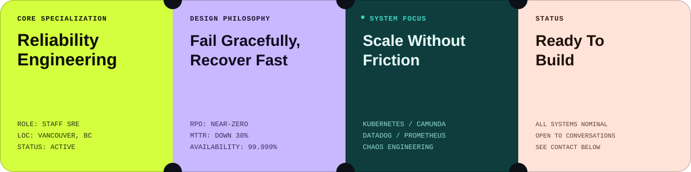
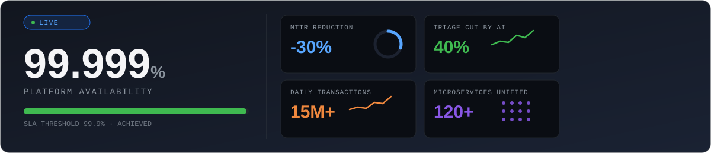
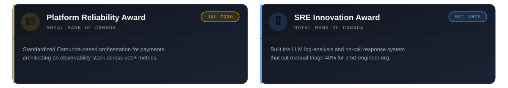
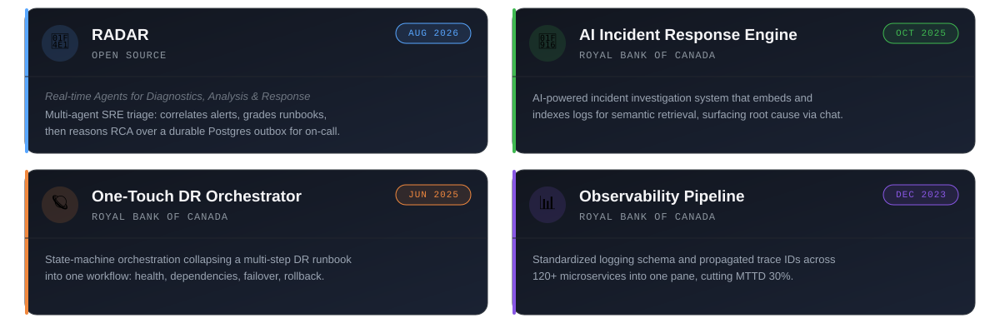

  

 

### 👋 Welcome to my corner of GitHub.!

## 🧑‍💻 Who I am ?

Somewhere in Canada right now, a payment is moving through a system I built the recovery architecture for, and it has no idea how many ways I've already tried to break it before it ever went live.

I'm a Staff Site Reliability Engineer at Royal Bank of Canada, owning the reliability of payment platforms that move millions of dollars a day, and my real job is architecture: designing the systems, automation, and increasingly AI-assisted tooling that make watching a dashboard mostly unnecessary.

  

I came up through platform engineering the unglamorous way, first automating infrastructure for a provincial energy regulator, then building reliability platforms for one of the country's largest banks. Different industries, same lesson: treat failure as something you design for, not something that surprises you, and build systems that bend under pressure instead of snapping.

  

## 🏗️ What I Build

- 🔁 **Recovery architecture that assumes the worst** | zero data loss for high volume payment flows
- 🎯 **Reliability engineering as a craft** | SLO frameworks and failure mode analysis, not an afterthought
- 🧰 **Tools engineers actually reach for** | disaster recovery utility used by 50+ engineers
- 🧨 **Chaos engineering, done properly** | broke things on purpose, cut MTTR by a third
- 🤖 **AI that earns its keep in production** | LLM tooling cutting manual triage 40% for a 50-person org

<b>The longer version, if you've got a minute</b>

 

🔁 **Recovery architecture that assumes the worst.** I designed a zero data loss recovery system for high volume payment flows, layering proactive observability and automated failure detection directly into the system's core, so it starts correcting itself before a human ever has to.

🎯 **Reliability engineering as a craft, not a checklist.** I develop the observability strategy, SLO frameworks, and failure mode analysis that turn reliability into a property of the system rather than an afterthought. Unified monitoring across 120+ microservices and 99.99% availability at 3x scale is the kind of proof I mean.

🧰 **Tools engineers actually reach for.** 50+ engineers now run a disaster recovery utility I built, and the golden path templates and reliability standards that came out of that work are used organization wide across payments today.

🧨 **Chaos engineering, done properly.** Most teams run one chaos exercise and call it a program. I built and ran one spanning the platform, the payment engine, and the infrastructure underneath both, cutting MTTR by close to a third by finding the cracks before customers do.

🤖 **AI that earns its keep in production.** I've built LLM powered systems for log analysis and incident triage that now handle nearly 40% of what used to be manual detective work across a fifty person engineering org. A language model reading ten thousand log lines outperforms a human doing the same thing, every single time, and that's reason enough to build around it.

## 📊 Impact, in numbers

  

## 🧰 Tech Stack

| Category | My Toolkit |
|---|---|
| **Platforms & Orchestration** |     |
| **Observability** |      |
| **Automation & Languages** |     |
| **CI/CD** |   |
| **AI / LLM Engineering** |    |

## 🏆 Achievements & Awards

  

## 🚀 Key Projects

  

## 📈 GitHub Activity

## 🎓 Background

  

## 📫 Get In Touch

If you want to talk distributed systems, reliability architecture, or where AI actually earns its place in incident response, my inbox is open.

  🛠️ Building systems that don't need heroics to stay up.

